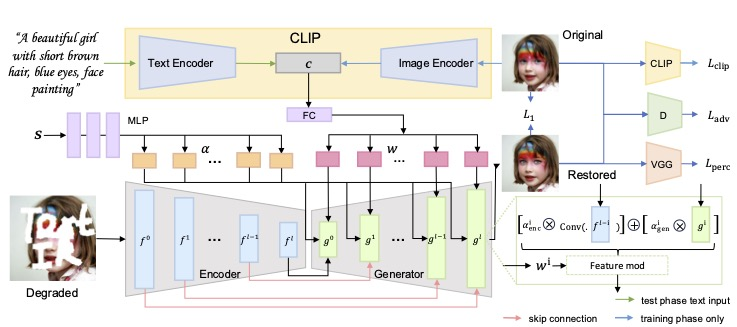

### :book: (TVCG 2025) TextIR: A Simple Framework for Text-based Editable Image Restoration

> [[Paper](https://arxiv.org/abs/2302.14736)] &emsp; [[Project Page](https://arxiv.org/abs/2302.14736)] &emsp; <br>
> [Yunpeng Bai](), [Cairong Wang](), [Shuzhao Xie](), [Chao Dong](), [Chun Yuan](), [Zhi Wang]() <br>
Tsinghua University; Shenzhen Institute of Advanced Technology, Chinese Academy of Sciences; Shanghai AI Laboratory, Shanghai, China



#### Results
[🎥 Click here to watch the demo video](assets/demo.mp4)
<video src="assets/demo.mp4" width="800px" controls></video>


---

## Dependencies and Installation

- Python >= 3.7 (Recommend to use [Anaconda](https://www.anaconda.com/download/#linux) or [Miniconda](https://docs.conda.io/en/latest/miniconda.html))
- [PyTorch >= 1.7](https://pytorch.org/)
- Option: NVIDIA GPU + [CUDA](https://developer.nvidia.com/cuda-downloads)
- Option: Linux

### Installation
1. Clone repo

    ```bash
    git clone https://github.com/yunpeng1998/TextIR
    cd TextIR
    ```

1. Install dependent packages

    ```bash
    pip install -r requirements.txt
    ```

## Inference

**Inference**
  
```bash
python ./inference/inference_textIR_sr.py
```


## Training

We provide the training codes for TextIR.

**Procedures**

1. Training dataset preparation: [FFHQ](https://github.com/NVlabs/ffhq-dataset)


 Modify the configuration file `options/*.yml` accordingly.

1. Training

> python -m torch.distributed.launch --nproc_per_node=8 --master_port=22021 basicsr/train.py -opt options/train/*.yml --launcher pytorch


## Model Zoo 

| Model Name  | Description | 
| :---:        |     :---:      |
| [ffhq-sr-1024](https://drive.google.com/drive/folders/1Xc2xUXT0gtiJv-CSeFsl_ghieKcdOjDo?usp=sharing) | 1024 human face SR model . |
| [ffhq-sr-512](https://drive.google.com/drive/folders/1qDpFvne60qzZBs03kY-9mm4odFZcUcE-?usp=sharing) |  512 human face SR model. |
| [CUB-sr-512](https://drive.google.com/drive/folders/11PqvN01pacKlkMcwlhm1reUHU65fbqId?usp=sharing) |  512 bird image SR model. |
| [CUB-inpainting-256](https://drive.google.com/drive/folders/1iStHvmc9yyBuQ9Zo3mCnC5U81GBaYQHs?usp=sharing) | 256  bird image inpainting model. |
| [ffhq-inpainting-256](https://drive.google.com/drive/folders/1klwCgsHQKUcQM7uNftTVo5XC3YRTbY_s?usp=sharing) |  256 human face image inpainting model. |
| [places-inpainting-256](https://drive.google.com/drive/folders/1oE14pM8-BQBpnVyBYeDFQ5Z8_FnQAQpg?usp=sharing) |  256 scene image inpainting model. |
| [ImageNet-colorization-256](https://drive.google.com/drive/folders/10nQTVsAMREMnhFl2Y4nh6vVqMVJ0wa90?usp=drive_link) |  256 image colorization model. |

## BibTeX

    @article{bai2025textir,
        title={Textir: A simple framework for text-based editable image restoration},
        author={Bai, Yunpeng and Wang, Cairong and Xie, Shuzhao and Dong, Chao and Yuan, Chun and Wang, Zhi},
        journal={IEEE Transactions on Visualization and Computer Graphics},
        year={2025},
        publisher={IEEE}
    }

